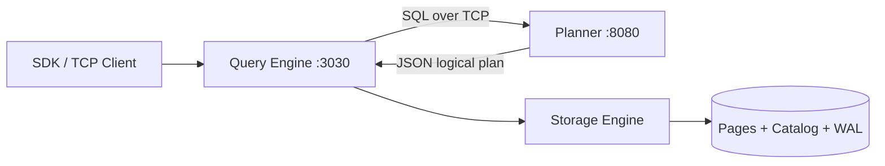

# A2GDB

A modular SQL database built from scratch in Go and Java. Queries flow through a dedicated planner service, execute on a pipelined query engine with operator-level parallelism, and persist through a page-based storage layer with buffering, logging, and catalog-backed table statistics.

## Architecture



1. **Planner** — Parses and validates SQL, produces a JSON logical plan (Apache Calcite relational algebra).
2. **Query engine** — Translates the plan into physical operators, runs them concurrently over channels, and returns rows.
3. **Storage engine** — Manages on-disk pages, the buffer pool, write-ahead logging, and per-table metadata used during scans and maintenance.

## Components

### Planner (`planner/`)

Java service built on **Apache Calcite** (parsing and planning only — not the execution runtime).

- Accepts SQL over TCP (`:8080`), returns a JSON-encoded logical plan for the engine to consume.
- Uses Calcite’s full pipeline for `SELECT`: parse → validate against registered schemas → `RelNode` → `RelJsonWriter` (operators like `LogicalTableScan`, `LogicalFilter`, `LogicalProject`, `LogicalAggregate`, `LogicalSort`).
- DDL support via `calcite-server` (`CREATE TABLE` with primary keys and typed columns).
- DML handlers serialize `INSERT`, `UPDATE`, and `DELETE` into engine-specific JSON when a relational plan is not needed.
- Schema is registered in-memory for validation; table definitions are also persisted by the storage catalog so they survive restarts.

See `planner/src/main/docs/planner.md` for Calcite integration notes.

### Query engine (`query-storage-engine/`)

Go runtime that owns scheduling, execution, and resource control.

**Plan execution**

- `ComputeNodes` maps Calcite logical operators to physical nodes (`TableScan`, `Projection`, `Filter`, `Sort`, `Aggregate`, `Collector`).
- Each operator runs in its own goroutine and passes row batches over buffered channels — a volcano-style pipeline with intra-query parallelism.
- Scan and projection stages fan out to multiple workers (e.g. parallel page reads and column projection).

**Scheduling and backpressure**

- `QueryScheduler` classifies work as CRUD vs non-CRUD and coordinates admission under load.
- `SystemInfoCollector` monitors host RAM and disk (via `gopsutil`); when resources are scarce, new queries wait with a timeout instead of unbounded allocation.
- `ResultManager` routes completed results back to the client subscription for each query ID.

**Concurrency**

- `LockManager` provides per-row read/write locks so concurrent operators can safely read and update in-memory rows.

**Memory**

- Hierarchical `MemoryContext` trees with size-class allocation strategies (small / medium / large objects).
- `ContextManager` pools and reuses contexts across similar queries to cut allocation overhead on hot paths.

### Storage engine (`query-storage-engine/engines/`)

Embedded in the query engine process; not a separate network service.

**On-disk layout**

- `DiskManagerV2` owns the database directory, a serialized **catalog** (`PageCatalog`), and per-table data files under `Tables/`.
- `TableInfo` tracks schema, **page count**, and **used space** — statistics the scan path uses (e.g. `NumOfPages` when reading a table).

**Buffer pool**

- Fixed-size frame pool (`BufferPoolManager`) with page table mapping and pin/unpin semantics.
- **LRU-K** replacement policy (`LRU-K.go`) for eviction under memory pressure.
- Background flush paths coordinate dirty pages back to disk.

**Durability and maintenance**

- **WAL** (`WalManager`) records inserts, updates, deletes, commits, and aborts with LSNs and before/after images.
- **Vacuum** reorganizes fragmented pages and compacts free space using tiered page fill levels.
- `LockManager` + WAL together support transactional-style mutation paths in the engine.

### Client SDK (`sdk/`)

Go library that speaks a small custom TCP protocol to the engine (`:3030`): authentication, table creation, and query submission. The engine forwards SQL to the planner when a fresh logical plan is required.

## SQL support

DDL and DML coverage includes `CREATE TABLE`, `INSERT`, `UPDATE`, `DELETE`, filtering, ordering, `LIMIT`, `GROUP BY` aggregates (`COUNT`, `MAX`, `MIN`, `AVG`, `SUM`), and join variants. See `supported.sql` for the exercised query set and correctness checklist.

## Tech stack

| Layer        | Stack                                      |
| ------------ | ------------------------------------------ |
| Planner      | Java, Apache Calcite 1.38, Maven           |
| Engine + SDK | Go, custom TCP protocols                   |
| Storage      | Page files, catalog serialization, WAL     |
| Observability| `logrus`, `gopsutil` (host resource stats) |

## Project layout

```
A2GDB/
├── planner/                 # Calcite-based SQL planner (Java)
├── query-storage-engine/    # Engine, storage, scheduler, tests (Go)
├── sdk/                     # Client library (Go)
├── supported.sql            # Supported queries / test matrix
└── design docs/             # Design notes (e.g. memory manager)
```

## Running locally

**Prerequisites:** Java 17+, Maven, Go 1.21+

1. Start the planner (from `planner/`):

   ```bash
   mvn compile exec:java -Dexec.mainClass="engine.QueryPlanner"
   ```

2. Start the query engine (from `query-storage-engine/`):

   ```bash
   go run .
   ```

   The engine listens on `localhost:3030` and expects the planner on `localhost:8080`.

3. Use the SDK (`sdk/`) or send SQL through the engine’s TCP interface; the engine will request a plan from the planner when needed.

Tests live under `query-storage-engine/tests/` (`correctness_test.go`, `performance_test.go` benchmarks).

## Design notes

- **Modular boundary:** Planner and engine communicate only through JSON plans over TCP, so either side can evolve independently.
- **Statistics-informed scans:** Table metadata (page counts, space usage) is maintained in the catalog and consulted during table scans — groundwork for richer cost-based planning in Calcite later.
- **Parallel, not clustered:** Execution is distributed across operator goroutines within a single process; there is no multi-host cluster layer yet.
